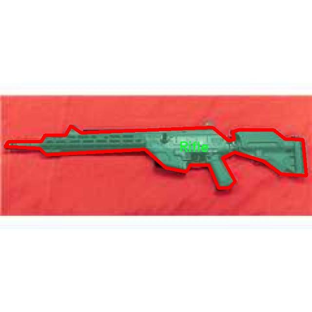
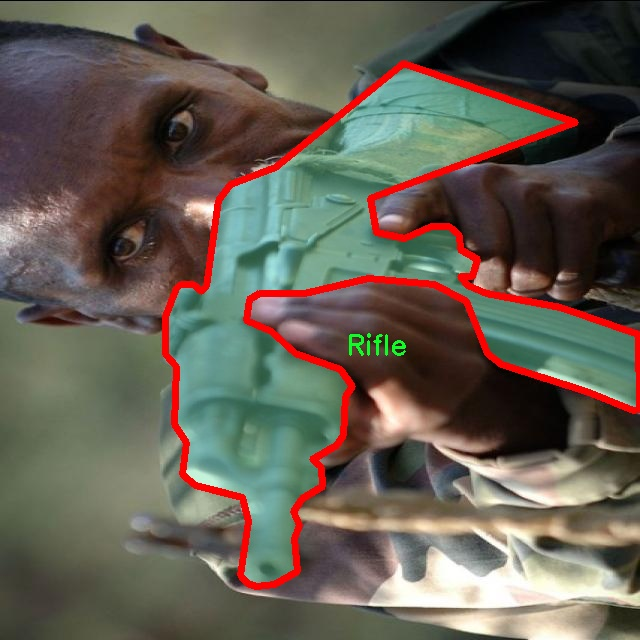

# 武器图像分割系统源码＆数据集分享
 [yolov8-seg＆yolov8-seg-EfficientFormerV2等50+全套改进创新点发刊_一键训练教程_Web前端展示]

### 1.研究背景与意义

项目参考[ILSVRC ImageNet Large Scale Visual Recognition Challenge](https://gitee.com/YOLOv8_YOLOv11_Segmentation_Studio/projects)

项目来源[AAAI Global Al lnnovation Contest](https://kdocs.cn/l/cszuIiCKVNis)

研究背景与意义

随着科技的迅猛发展，计算机视觉技术在各个领域的应用日益广泛，尤其是在安全监控、公共安全和军事领域，图像分割技术的研究与应用显得尤为重要。武器检测与识别是安全防范系统中的关键环节，能够有效提高公共场所的安全性，减少潜在的暴力事件。传统的武器检测方法多依赖于人工识别和简单的图像处理技术，存在识别效率低、准确性差等问题。因此，基于深度学习的图像分割技术应运而生，成为提升武器检测精度和效率的重要手段。

YOLO（You Only Look Once）系列模型以其高效的实时检测能力和较高的准确率，广泛应用于物体检测领域。YOLOv8作为该系列的最新版本，具备了更强的特征提取能力和更快的推理速度，适合于复杂环境下的武器图像分割任务。然而，尽管YOLOv8在目标检测方面表现优异，但在细粒度的图像分割任务中仍存在一定的局限性，尤其是在处理多类武器时，如何有效地进行实例分割，仍然是一个亟待解决的问题。

本研究旨在基于改进的YOLOv8模型，构建一个高效的武器图像分割系统。我们使用的数据集包含3000张图像，涵盖手枪、刀具、步枪、玩具等五个类别，提供了丰富的样本和多样的场景。这一数据集的构建为模型的训练和评估提供了坚实的基础。通过对数据集的深入分析，我们可以识别出不同武器在图像中的特征，进而优化模型的参数设置，提高分割的准确性和鲁棒性。

此外，随着社会对公共安全的重视程度不断提高，武器检测与识别的研究不仅具有学术价值，更具备重要的社会意义。通过实现高效的武器图像分割系统，可以为安保人员提供更为精准的工具，帮助他们在关键时刻做出迅速反应，降低安全隐患。同时，该系统的应用还可以为相关领域的研究提供新的思路和方法，推动计算机视觉技术在实际应用中的进一步发展。

总之，基于改进YOLOv8的武器图像分割系统的研究，不仅能够提升武器检测的准确性和效率，还有助于推动相关技术的进步与应用，具有重要的理论意义和实际价值。通过这一研究，我们希望能够为公共安全领域提供更为先进的技术支持，助力构建更加安全的社会环境。

### 2.图片演示


##### 注意：由于此博客编辑较早，上面“2.图片演示”和“3.视频演示”展示的系统图片或者视频可能为老版本，新版本在老版本的基础上升级如下：（实际效果以升级的新版本为准）

  （1）适配了YOLOV8的“目标检测”模型和“实例分割”模型，通过加载相应的权重（.pt）文件即可自适应加载模型。

  （2）支持“图片识别”、“视频识别”、“摄像头实时识别”三种识别模式。

  （3）支持“图片识别”、“视频识别”、“摄像头实时识别”三种识别结果保存导出，解决手动导出（容易卡顿出现爆内存）存在的问题，识别完自动保存结果并导出到tempDir中。

  （4）支持Web前端系统中的标题、背景图等自定义修改，后面提供修改教程。

  另外本项目提供训练的数据集和训练教程,暂不提供权重文件（best.pt）,需要您按照教程进行训练后实现图片演示和Web前端界面演示的效果。

### 3.视频演示

[3.1 视频演示](https://www.bilibili.com/video/BV1SGyzYVEb3/)

### 4.数据集信息展示

##### 4.1 本项目数据集详细数据（类别数＆类别名）

nc: 4
names: ['Handgun', 'Knife', 'Rifle', 'Toy']


##### 4.2 本项目数据集信息介绍

数据集信息展示

在现代计算机视觉领域，图像分割技术的进步为多种应用场景提供了强有力的支持，尤其是在安全监控、武器检测和自动化安防系统中。为此，本研究所使用的“Gun Instance Segmentation Model”数据集，专门设计用于训练和改进YOLOv8-seg的武器图像分割系统，具有重要的应用价值和研究意义。该数据集包含四个主要类别，分别是手枪（Handgun）、刀具（Knife）、步枪（Rifle）和玩具（Toy），这些类别的选择不仅反映了现实生活中武器的多样性，也为模型的泛化能力提供了挑战。

数据集的构建过程充分考虑了多样性和代表性。每个类别的图像均经过精心挑选，确保其在不同的环境、角度和光照条件下的表现。手枪类图像展示了各种型号和品牌的手枪，涵盖了从小型自卫手枪到大型战斗手枪的广泛范围。刀具类则包括了不同类型的刀具，如军刀、折叠刀和厨房刀具等，这些图像不仅有助于模型识别真实武器，还能有效区分潜在的危险物品与日常生活中的工具。步枪类图像则集中在各种类型的步枪，包括狙击步枪和自动步枪，旨在帮助模型识别和分类不同类型的长枪。最后，玩具类的引入则是为了增加数据集的复杂性，确保模型能够在识别真实武器时不被外观相似的玩具误导。

在数据集的标注过程中，采用了精确的实例分割技术，为每个类别的图像提供了详细的像素级标注。这种标注方式不仅提升了模型的训练效果，也为后续的评估和验证提供了可靠的基础。通过这种高质量的标注，YOLOv8-seg模型能够在处理复杂场景时，准确识别和分割出每个武器实例，进而提高整体的检测精度和效率。

此外，数据集还包含了丰富的背景场景，以模拟真实世界中的各种应用场景。这些背景场景的多样性使得模型在训练过程中能够学习到更为复杂的特征，从而提升其在实际应用中的表现。例如，手枪和刀具可能出现在家庭环境、公共场所或户外场景中，而步枪则可能在军事演习或狩猎活动中出现。通过在多种背景下进行训练，模型能够更好地适应不同的环境变化，提高其在实际应用中的鲁棒性。

总之，“Gun Instance Segmentation Model”数据集为改进YOLOv8-seg的武器图像分割系统提供了坚实的基础。通过多样化的类别选择、精确的标注和丰富的背景场景，该数据集不仅增强了模型的学习能力，也为未来的研究和应用奠定了良好的基础。随着技术的不断进步和数据集的不断完善，期待这一系统能够在武器检测和安全监控领域发挥更大的作用。






### 5.全套项目环境部署视频教程（零基础手把手教学）

[5.1 环境部署教程链接（零基础手把手教学）](https://www.bilibili.com/video/BV1jG4Ve4E9t/?vd_source=bc9aec86d164b67a7004b996143742dc)


[5.2 安装Python虚拟环境创建和依赖库安装视频教程链接（零基础手把手教学）](https://www.bilibili.com/video/BV1nA4VeYEze/?vd_source=bc9aec86d164b67a7004b996143742dc)

### 6.手把手YOLOV8-seg训练视频教程（零基础小白有手就能学会）

[6.1 手把手YOLOV8-seg训练视频教程（零基础小白有手就能学会）](https://www.bilibili.com/video/BV1cA4VeYETe/?vd_source=bc9aec86d164b67a7004b996143742dc)


按照上面的训练视频教程链接加载项目提供的数据集，运行train.py即可开始训练



     Epoch   gpu_mem       box       obj       cls    labels  img_size
     1/200     0G   0.01576   0.01955  0.007536        22      1280: 100%|██████████| 849/849 [14:42<00:00,  1.04s/it]
               Class     Images     Labels          P          R     mAP@.5 mAP@.5:.95: 100%|██████████| 213/213 [01:14<00:00,  2.87it/s]
                 all       3395      17314      0.994      0.957      0.0957      0.0843

     Epoch   gpu_mem       box       obj       cls    labels  img_size
     2/200     0G   0.01578   0.01923  0.007006        22      1280: 100%|██████████| 849/849 [14:44<00:00,  1.04s/it]
               Class     Images     Labels          P          R     mAP@.5 mAP@.5:.95: 100%|██████████| 213/213 [01:12<00:00,  2.95it/s]
                 all       3395      17314      0.996      0.956      0.0957      0.0845

     Epoch   gpu_mem       box       obj       cls    labels  img_size
     3/200     0G   0.01561    0.0191  0.006895        27      1280: 100%|██████████| 849/849 [10:56<00:00,  1.29it/s]
               Class     Images     Labels          P          R     mAP@.5 mAP@.5:.95: 100%|███████   | 187/213 [00:52<00:00,  4.04it/s]
                 all       3395      17314      0.996      0.957      0.0957      0.0845


### 7.50+种全套YOLOV8-seg创新点代码加载调参视频教程（一键加载写好的改进模型的配置文件）

[7.1 50+种全套YOLOV8-seg创新点代码加载调参视频教程（一键加载写好的改进模型的配置文件）](https://www.bilibili.com/video/BV1Hw4VePEXv/?vd_source=bc9aec86d164b67a7004b996143742dc)

### 8.YOLOV8-seg图像分割算法原理

原始YOLOv8-seg算法原理

YOLOv8-seg算法是YOLO系列中的最新进展，旨在在目标检测的基础上实现更为精细的分割任务。该算法的设计理念源于YOLOv5和YOLOv7的成功经验，同时结合了近年来在深度学习领域的多项创新，形成了一种高效、准确且适应性强的目标检测与分割解决方案。YOLOv8-seg的核心在于其网络结构的精细化设计，主要包括输入端、骨干网络、颈部网络和头部网络四个部分。

在输入端，YOLOv8-seg采用了马赛克数据增强、自适应锚框计算和自适应灰度填充等技术，以提升模型的鲁棒性和泛化能力。马赛克增强技术通过将多张图像拼接在一起，生成新的训练样本，从而有效扩展了训练数据集，增强了模型对不同场景的适应性。然而，YOLOv8-seg在训练的最后阶段停止使用马赛克增强，以避免对数据真实分布的破坏，确保模型能够学习到更为真实的特征。

骨干网络部分，YOLOv8-seg引入了C2f模块，这一模块在YOLOv5的C3结构基础上进行了改进，采用了更多的跳层连接，以实现更丰富的梯度流。C2f模块的设计灵感来源于YOLOv7的ELAN结构，旨在通过增加特征图的多样性来提升模型的特征表示能力。与此同时，YOLOv8-seg依然保留了SPPF（Spatial Pyramid Pooling Fusion）模块，以确保在不同尺度下的特征融合效果。

颈部网络采用了路径聚合网络（PAN）结构，旨在增强网络对不同缩放尺度对象的特征融合能力。PAN结构通过自下而上的特征融合，结合了高层和低层特征信息，从而有效提高了模型对小目标的检测能力。这一结构的优势在于能够充分利用不同层次的特征，增强模型对复杂场景的理解能力。

在头部网络中，YOLOv8-seg将分类和检测过程进行了有效解耦，采用了无锚框检测头的设计理念。通过引入Task-Aligned Assigner策略，YOLOv8-seg能够根据分类与回归的分数加权结果，选择正样本进行损失计算。这一过程不仅提高了模型的收敛速度，还显著提升了目标检测的精度。分类分支采用了二元交叉熵损失（BCELoss），而回归分支则结合了分布焦点损失（DFLoss）和完全交并比损失函数（CIOULoss），以进一步提升边界框预测的准确性。

YOLOv8-seg的创新之处在于其无锚框结构的引入，这一设计使得模型在进行目标检测时不再依赖于预定义的锚框，而是直接预测目标的中心位置。这一改变不仅减少了锚框预测的数量，还加速了非最大抑制（NMS）过程，从而提升了模型的推理速度。此外，YOLOv8-seg在损失函数的设计上也进行了优化，采用了VFLLoss作为分类损失，结合DFLLoss和CIoULoss进行回归损失的计算，以应对目标检测中常见的样本不平衡问题。

在模型性能方面，YOLOv8-seg在COCO数据集上的表现相较于前代模型有了显著提升。通过对不同尺寸模型的参数进行调整，YOLOv8-seg实现了在保持较小模型体积的同时，提升了检测精度和推理速度。这一特性使得YOLOv8-seg在实时性要求较高的应用场景中表现出色，尤其适用于机器人视觉、自动驾驶等领域。

综上所述，YOLOv8-seg算法通过一系列创新设计，成功地将目标检测与分割任务结合在一起，形成了一种高效、准确的解决方案。其在输入端的增强策略、骨干网络的改进、颈部网络的特征融合以及头部网络的解耦设计，均为其在实际应用中的优越性能奠定了基础。随着YOLOv8-seg的不断发展和完善，未来在更多复杂场景中的应用前景将更加广阔。


### 9.系统功能展示（检测对象为举例，实际内容以本项目数据集为准）

图9.1.系统支持检测结果表格显示

  图9.2.系统支持置信度和IOU阈值手动调节

  图9.3.系统支持自定义加载权重文件best.pt(需要你通过步骤5中训练获得)

  图9.4.系统支持摄像头实时识别

  图9.5.系统支持图片识别

  图9.6.系统支持视频识别

  图9.7.系统支持识别结果文件自动保存

  图9.8.系统支持Excel导出检测结果数据


### 10.50+种全套YOLOV8-seg创新点原理讲解（非科班也可以轻松写刊发刊，V11版本正在科研待更新）

#### 10.1 由于篇幅限制，每个创新点的具体原理讲解就不一一展开，具体见下列网址中的创新点对应子项目的技术原理博客网址【Blog】：


[10.1 50+种全套YOLOV8-seg创新点原理讲解链接](https://gitee.com/qunmasj/good)

#### 10.2 部分改进模块原理讲解(完整的改进原理见上图和技术博客链接)【如果此小节的图加载失败可以通过CSDN或者Github搜索该博客的标题访问原始博客，原始博客图片显示正常】

### Gold-YOLO


#### Preliminaries
YOLO系列的中间层结构采用了传统的FPN结构，其中包含多个分支用于多尺度特征融合。然而，它只充分融合来自相邻级别的特征，对于其他层次的信息只能间接地进行“递归”获取。

传统的FPN结构在信息传输过程中存在丢失大量信息的问题。这是因为层之间的信息交互仅限于中间层选择的信息，未被选择的信息在传输过程中被丢弃。这种情况导致某个Level的信息只能充分辅助相邻层，而对其他全局层的帮助较弱。因此，整体上信息融合的有效性可能受到限制。
为了避免在传输过程中丢失信息，本文采用了一种新颖的“聚集和分发”机制（GD），放弃了原始的递归方法。该机制使用一个统一的模块来收集和融合所有Level的信息，并将其分发到不同的Level。通过这种方式，作者不仅避免了传统FPN结构固有的信息丢失问题，还增强了中间层的部分信息融合能力，而且并没有显著增加延迟。


#### 低阶聚合和分发分支 Low-stage gather-and-distribute branch
从主干网络中选择输出的B2、B3、B4、B5特征进行融合，以获取保留小目标信息的高分辨率特征。


#### 高阶聚合和分发分支 High-stage gather-and-distribute branch
高级全局特征对齐模块（High-GD）将由低级全局特征对齐模块（Low-GD）生成的特征{P3, P4, P5}进行融合。


Transformer融合模块由多个堆叠的transformer组成，transformer块的数量为L。每个transformer块包括一个多头注意力块、一个前馈网络（FFN）和残差连接。采用与LeViT相同的设置来配置多头注意力块，使用16个通道作为键K和查询Q的头维度，32个通道作为值V的头维度。为了加速推理过程，将层归一化操作替换为批归一化，并将所有的GELU激活函数替换为ReLU。为了增强变换器块的局部连接，在两个1x1卷积层之间添加了一个深度卷积层。同时，将FFN的扩展因子设置为2，以在速度和计算成本之间取得平衡。


信息注入模块(Information injection module)： 高级全局特征对齐模块（High-GD）中的信息注入模块与低级全局特征对齐模块（Low-GD）中的相同。在高级阶段，局部特征（Flocal）等于Pi，因此公式如下所示：


#### 增强的跨层信息流动 Enhanced cross-layer information flow
为了进一步提升性能，从YOLOv6 中的PAFPN模块中得到启发，引入了Inject-LAF模块。该模块是注入模块的增强版，包括了一个轻量级相邻层融合（LAF）模块，该模块被添加到注入模块的输入位置。为了在速度和准确性之间取得平衡，设计了两个LAF模型：LAF低级模型和LAF高级模型，分别用于低级注入（合并相邻两层的特征）和高级注入（合并相邻一层的特征）。它们的结构如图5(b)所示。为了确保来自不同层级的特征图与目标大小对齐，在实现中的两个LAF模型仅使用了三个操作符：双线性插值（上采样过小的特征）、平均池化（下采样过大的特征）和1x1卷积（调整与目标通道不同的特征）。模型中的LAF模块与信息注入模块的结合有效地平衡了准确性和速度之间的关系。通过使用简化的操作，能够增加不同层级之间的信息流路径数量，从而提高性能而不显著增加延迟。


### 11.项目核心源码讲解（再也不用担心看不懂代码逻辑）

#### 11.1 ultralytics\utils\callbacks\neptune.py

以下是对给定代码的核心部分进行分析和详细注释的结果：

```python
# 导入必要的库和模块
from ultralytics.utils import LOGGER, SETTINGS, TESTS_RUNNING

# 尝试导入NeptuneAI库并进行基本的初始化检查
try:
    assert not TESTS_RUNNING  # 确保不在测试环境中
    assert SETTINGS['neptune'] is True  # 确保Neptune集成已启用
    import neptune
    from neptune.types import File

    assert hasattr(neptune, '__version__')  # 确保Neptune库有版本属性

    run = None  # 初始化NeptuneAI实验记录实例

except (ImportError, AssertionError):
    neptune = None  # 如果导入失败或断言失败，则将neptune设置为None


def _log_scalars(scalars, step=0):
    """将标量数据记录到NeptuneAI实验记录器中。"""
    if run:  # 如果Neptune实例已初始化
        for k, v in scalars.items():  # 遍历标量字典
            run[k].append(value=v, step=step)  # 记录每个标量值


def _log_images(imgs_dict, group=''):
    """将图像记录到NeptuneAI实验记录器中。"""
    if run:  # 如果Neptune实例已初始化
        for k, v in imgs_dict.items():  # 遍历图像字典
            run[f'{group}/{k}'].upload(File(v))  # 上传每个图像文件


def on_pretrain_routine_start(trainer):
    """在训练例程开始之前调用的回调函数。"""
    try:
        global run  # 声明全局变量run
        # 初始化Neptune运行实例，设置项目和名称
        run = neptune.init_run(project=trainer.args.project or 'YOLOv8', name=trainer.args.name, tags=['YOLOv8'])
        # 记录超参数配置
        run['Configuration/Hyperparameters'] = {k: '' if v is None else v for k, v in vars(trainer.args).items()}
    except Exception as e:
        LOGGER.warning(f'WARNING ⚠️ NeptuneAI安装但未正确初始化，未记录此运行。 {e}')


def on_train_epoch_end(trainer):
    """每个训练周期结束时调用的回调函数。"""
    # 记录训练损失和学习率
    _log_scalars(trainer.label_loss_items(trainer.tloss, prefix='train'), trainer.epoch + 1)
    _log_scalars(trainer.lr, trainer.epoch + 1)
    # 在第一个周期结束时记录训练图像
    if trainer.epoch == 1:
        _log_images({f.stem: str(f) for f in trainer.save_dir.glob('train_batch*.jpg')}, 'Mosaic')


def on_train_end(trainer):
    """训练结束时调用的回调函数。"""
    if run:  # 如果Neptune实例已初始化
        # 记录最终结果和模型
        files = [
            'results.png', 'confusion_matrix.png', 'confusion_matrix_normalized.png',
            *(f'{x}_curve.png' for x in ('F1', 'PR', 'P', 'R'))]
        # 过滤存在的文件
        files = [(trainer.save_dir / f) for f in files if (trainer.save_dir / f).exists()]
        for f in files:
            _log_plot(title=f.stem, plot_path=f)  # 记录每个图像
        # 记录最佳模型
        run[f'weights/{trainer.args.name or trainer.args.task}/{str(trainer.best.name)}'].upload(File(str(trainer.best)))


# 定义回调函数字典
callbacks = {
    'on_pretrain_routine_start': on_pretrain_routine_start,
    'on_train_epoch_end': on_train_epoch_end,
    'on_train_end': on_train_end
} if neptune else {}
```

### 代码分析与注释说明：

1. **导入部分**：
   - 导入了`LOGGER`、`SETTINGS`和`TESTS_RUNNING`等工具，这些工具用于日志记录和设置管理。
   - 尝试导入`neptune`库并进行一些基本的检查，确保环境的正确性。

2. **NeptuneAI初始化**：
   - 使用`try-except`结构来处理导入和初始化中的潜在错误。
   - 如果成功，`run`变量将用于记录实验数据。

3. **日志记录函数**：
   - `_log_scalars`：用于记录标量数据（如损失和学习率）。
   - `_log_images`：用于记录图像数据，支持将图像上传到Neptune。

4. **回调函数**：
   - `on_pretrain_routine_start`：在训练开始前初始化Neptune运行，并记录超参数。
   - `on_train_epoch_end`：在每个训练周期结束时记录损失和学习率，并在第一个周期结束时记录训练图像。
   - `on_train_end`：在训练结束时记录最终结果和最佳模型。

5. **回调字典**：
   - 根据是否成功导入`neptune`，定义了一个回调函数字典，以便在训练过程中调用相应的回调函数。

这些核心部分和注释可以帮助理解代码的功能和逻辑，便于后续的维护和扩展。

这个文件是一个用于集成NeptuneAI的回调函数模块，主要用于在Ultralytics YOLO训练过程中记录实验的各种信息，包括标量、图像和图表等。文件的开头部分导入了一些必要的库和模块，并进行了基本的错误处理，以确保在没有安装Neptune或未正确配置的情况下不会导致程序崩溃。

首先，文件中定义了一个全局变量`run`，用于存储NeptuneAI实验记录实例。接下来，定义了一些私有函数，用于记录不同类型的数据到NeptuneAI。`_log_scalars`函数用于记录标量数据，`_log_images`函数用于记录图像，`_log_plot`函数则用于记录图表。每个函数都首先检查`run`是否已初始化，如果是，则将相应的数据上传到Neptune。

文件中还定义了一些回调函数，这些函数在训练过程中的特定时刻被调用。`on_pretrain_routine_start`函数在训练开始前被调用，负责初始化Neptune运行并记录超参数配置。`on_train_epoch_end`函数在每个训练周期结束时被调用，记录训练损失和学习率，并在第一个周期结束时记录训练图像。`on_fit_epoch_end`函数在每个训练和验证周期结束时被调用，记录模型信息和指标。`on_val_end`函数在验证结束时被调用，记录验证图像。最后，`on_train_end`函数在训练结束时被调用，记录最终结果、混淆矩阵和PR曲线等，并上传最佳模型。

最后，文件创建了一个`callbacks`字典，将上述回调函数与相应的事件关联起来，只有在Neptune被正确初始化的情况下，这些回调函数才会被注册。整体来看，这个文件为YOLO模型的训练过程提供了强大的日志记录功能，方便用户跟踪和分析实验结果。

#### 11.2 ui.py

以下是代码中最核心的部分，并附上详细的中文注释：

```python
import sys
import subprocess

def run_script(script_path):
    """
    使用当前 Python 环境运行指定的脚本。

    Args:
        script_path (str): 要运行的脚本路径

    Returns:
        None
    """
    # 获取当前 Python 解释器的路径
    python_path = sys.executable

    # 构建运行命令，使用 streamlit 运行指定的脚本
    command = f'"{python_path}" -m streamlit run "{script_path}"'

    # 执行命令
    result = subprocess.run(command, shell=True)
    # 检查命令执行的返回码，如果不为0，表示出错
    if result.returncode != 0:
        print("脚本运行出错。")

# 主程序入口
if __name__ == "__main__":
    # 指定要运行的脚本路径
    script_path = "web.py"  # 这里可以直接指定脚本名，假设它在当前目录下

    # 调用函数运行脚本
    run_script(script_path)
```

### 代码注释说明：
1. **导入模块**：
   - `sys`：用于访问与 Python 解释器紧密相关的变量和函数。
   - `subprocess`：用于创建新进程、连接到它们的输入/输出/错误管道，并获取它们的返回码。

2. **`run_script` 函数**：
   - 接受一个参数 `script_path`，表示要运行的 Python 脚本的路径。
   - 使用 `sys.executable` 获取当前 Python 解释器的路径，以确保使用正确的 Python 环境来运行脚本。
   - 构建一个命令字符串，使用 `streamlit` 模块运行指定的脚本。
   - 使用 `subprocess.run` 执行构建的命令，并检查返回码以判断脚本是否成功运行。

3. **主程序入口**：
   - 在 `if __name__ == "__main__":` 块中，指定要运行的脚本路径，并调用 `run_script` 函数来执行该脚本。

这个程序文件名为 `ui.py`，主要功能是使用当前的 Python 环境来运行一个指定的脚本，具体是一个名为 `web.py` 的文件。程序的核心逻辑是通过调用系统命令来执行这个脚本。

首先，程序导入了几个必要的模块，包括 `sys`、`os` 和 `subprocess`。其中，`sys` 模块用于访问与 Python 解释器相关的变量和函数，`os` 模块提供了与操作系统交互的功能，而 `subprocess` 模块则用于执行外部命令。

接着，程序从 `QtFusion.path` 模块中导入了 `abs_path` 函数，这个函数的作用是获取给定路径的绝对路径。

在 `run_script` 函数中，程序首先获取当前 Python 解释器的路径，存储在 `python_path` 变量中。然后，构建一个命令字符串，命令的格式是使用 Python 解释器运行 `streamlit` 模块，并指定要运行的脚本路径。这个命令通过 `subprocess.run` 函数执行，`shell=True` 参数允许在 shell 中执行命令。

如果脚本运行过程中出现错误，程序会检查 `result.returncode` 的值，如果不等于 0，说明脚本运行出错，程序会打印出相应的错误信息。

在文件的最后部分，使用 `if __name__ == "__main__":` 语句来确保只有在直接运行该脚本时才会执行以下代码。这里指定了要运行的脚本路径 `web.py`，并调用 `run_script` 函数来执行这个脚本。

总的来说，这个程序的功能是简化了使用 Python 环境运行 `web.py` 脚本的过程，并且能够处理可能出现的错误。

#### 11.3 ultralytics\nn\backbone\CSwomTramsformer.py

以下是经过简化和注释的核心代码部分，主要保留了CSWin Transformer的结构和功能：

```python
import torch
import torch.nn as nn
import numpy as np

class Mlp(nn.Module):
    """多层感知机（MLP）模块"""
    def __init__(self, in_features, hidden_features=None, out_features=None, act_layer=nn.GELU, drop=0.):
        super().__init__()
        out_features = out_features or in_features  # 输出特征数
        hidden_features = hidden_features or in_features  # 隐藏层特征数
        self.fc1 = nn.Linear(in_features, hidden_features)  # 第一层线性变换
        self.act = act_layer()  # 激活函数
        self.fc2 = nn.Linear(hidden_features, out_features)  # 第二层线性变换
        self.drop = nn.Dropout(drop)  # Dropout层

    def forward(self, x):
        """前向传播"""
        x = self.fc1(x)
        x = self.act(x)
        x = self.drop(x)
        x = self.fc2(x)
        x = self.drop(x)
        return x

class CSWinBlock(nn.Module):
    """CSWin Transformer的基本模块"""
    def __init__(self, dim, num_heads, mlp_ratio=4., drop=0., attn_drop=0.):
        super().__init__()
        self.dim = dim  # 输入特征维度
        self.num_heads = num_heads  # 注意力头数
        self.mlp_ratio = mlp_ratio  # MLP的隐藏层比率
        self.qkv = nn.Linear(dim, dim * 3)  # QKV线性变换
        self.norm1 = nn.LayerNorm(dim)  # 归一化层
        self.attn = LePEAttention(dim, num_heads=num_heads, attn_drop=attn_drop)  # 注意力层
        self.mlp = Mlp(in_features=dim, hidden_features=int(dim * mlp_ratio), out_features=dim)  # MLP层
        self.drop_path = nn.Identity()  # DropPath层（可选）

    def forward(self, x):
        """前向传播"""
        img = self.norm1(x)  # 归一化
        qkv = self.qkv(img).reshape(-1, 3, self.dim)  # 计算QKV
        x = self.attn(qkv)  # 计算注意力
        x = x + self.drop_path(x)  # 残差连接
        x = x + self.drop_path(self.mlp(x))  # MLP层的残差连接
        return x

class CSWinTransformer(nn.Module):
    """CSWin Transformer模型"""
    def __init__(self, img_size=640, num_classes=1000, embed_dim=96, depth=[2, 2, 6, 2], num_heads=12):
        super().__init__()
        self.num_classes = num_classes
        self.embed_dim = embed_dim  # 嵌入维度
        self.stage1 = nn.ModuleList([CSWinBlock(embed_dim, num_heads) for _ in range(depth[0])])  # 第一阶段
        self.stage2 = nn.ModuleList([CSWinBlock(embed_dim * 2, num_heads) for _ in range(depth[1])])  # 第二阶段
        self.stage3 = nn.ModuleList([CSWinBlock(embed_dim * 4, num_heads) for _ in range(depth[2])])  # 第三阶段
        self.stage4 = nn.ModuleList([CSWinBlock(embed_dim * 8, num_heads) for _ in range(depth[3])])  # 第四阶段

    def forward(self, x):
        """前向传播"""
        for stage in [self.stage1, self.stage2, self.stage3, self.stage4]:
            for block in stage:
                x = block(x)  # 逐层通过CSWinBlock
        return x

# 示例用法
if __name__ == '__main__':
    inputs = torch.randn((1, 3, 640, 640))  # 输入数据
    model = CSWinTransformer()  # 创建模型
    res = model(inputs)  # 前向传播
    print(res.size())  # 输出结果的尺寸
```

### 代码注释说明：
1. **Mlp类**：实现了一个简单的多层感知机，包括两个线性层和一个激活函数，支持Dropout。
2. **CSWinBlock类**：这是CSWin Transformer的基本构建块，包含了注意力机制和MLP层。通过归一化和残差连接来增强特征表达。
3. **CSWinTransformer类**：整体模型的实现，包含多个CSWinBlock的堆叠，形成不同的阶段。
4. **前向传播**：每个阶段依次处理输入，最终输出特征。

通过这种方式，代码的核心结构和功能得以保留，同时也增加了可读性和理解性。

该程序文件实现了一个名为CSWin Transformer的深度学习模型，主要用于计算机视觉任务。该模型是由微软公司开发的，使用了多种现代深度学习技术，特别是在图像处理和特征提取方面。文件中包含多个类和函数，下面是对其主要部分的讲解。

首先，文件引入了必要的库，包括PyTorch和一些辅助模块。这些库提供了构建神经网络所需的基础功能，如张量操作、神经网络层、激活函数等。

文件中定义了多个类，其中最重要的是`CSWinTransformer`类。该类构建了整个CSWin Transformer模型。模型的输入为图像，输出为经过多个阶段处理后的特征图。模型的结构包括多个阶段，每个阶段由多个`CSWinBlock`组成，每个`CSWinBlock`又包含了自注意力机制和前馈网络。

`Mlp`类定义了一个多层感知机（MLP），用于特征的非线性变换。`LePEAttention`类实现了局部增强自注意力机制，该机制通过将输入图像划分为窗口来提高计算效率。`CSWinBlock`类则将这些注意力机制和MLP结合在一起，形成了模型的基本构建块。

在`CSWinTransformer`类的构造函数中，首先定义了输入图像的处理方式，包括卷积层和重排操作，以便将图像转换为适合模型处理的格式。接着，模型的各个阶段被依次构建，每个阶段的深度、头数和其他参数都可以通过构造函数的参数进行调整。

此外，文件中还定义了一些辅助函数，如`img2windows`和`windows2img`，用于在图像和窗口表示之间进行转换。这些函数对于实现局部自注意力机制至关重要。

最后，文件提供了多个模型的构建函数，如`CSWin_tiny`、`CSWin_small`、`CSWin_base`和`CSWin_large`，这些函数根据不同的参数配置创建不同规模的CSWin Transformer模型，并支持加载预训练权重。

在文件的末尾，提供了一个简单的测试代码，创建了不同规模的模型并对随机输入进行前向传播，输出各个模型的特征图尺寸。这部分代码用于验证模型的正确性和功能。

总的来说，该文件实现了一个灵活且强大的视觉变换器模型，适用于各种计算机视觉任务，具有良好的扩展性和可调性。

#### 11.4 train.py

以下是经过简化和注释的核心代码部分：

```python
import os
import torch
import yaml
from ultralytics import YOLO  # 导入YOLO模型库

if __name__ == '__main__':  # 确保该模块被直接运行时才执行以下代码
    # 设置训练参数
    workers = 1  # 数据加载时使用的工作进程数量
    batch = 8  # 每个批次的样本数量
    device = "0" if torch.cuda.is_available() else "cpu"  # 检查是否有可用的GPU，选择设备

    # 获取数据集配置文件的绝对路径
    data_path = abs_path(f'datasets/data/data.yaml', path_type='current')

    # 将路径格式转换为Unix风格
    unix_style_path = data_path.replace(os.sep, '/')
    # 获取数据集所在目录
    directory_path = os.path.dirname(unix_style_path)

    # 读取YAML文件，保持原有顺序
    with open(data_path, 'r') as file:
        data = yaml.load(file, Loader=yaml.FullLoader)

    # 修改数据集路径
    if 'train' in data and 'val' in data and 'test' in data:
        data['train'] = directory_path + '/train'  # 更新训练集路径
        data['val'] = directory_path + '/val'      # 更新验证集路径
        data['test'] = directory_path + '/test'    # 更新测试集路径

        # 将修改后的数据写回YAML文件
        with open(data_path, 'w') as file:
            yaml.safe_dump(data, file, sort_keys=False)

    # 加载YOLO模型
    model = YOLO(r"C:\codeseg\codenew\50+种YOLOv8算法改进源码大全和调试加载训练教程（非必要）\改进YOLOv8模型配置文件\yolov8-seg-C2f-Faster.yaml").load("./weights/yolov8s-seg.pt")

    # 开始训练模型
    results = model.train(
        data=data_path,  # 指定训练数据的配置文件路径
        device=device,    # 指定使用的设备
        workers=workers,  # 指定工作进程数量
        imgsz=640,        # 输入图像的大小
        epochs=100,       # 训练的轮数
        batch=batch,      # 每个批次的大小
    )
```

### 代码注释说明：
1. **导入必要的库**：导入了处理文件路径、深度学习框架（PyTorch）、YAML文件解析和YOLO模型的库。
2. **设置训练参数**：定义了工作进程数量、批次大小和设备选择（GPU或CPU）。
3. **读取和修改数据集配置**：读取YAML文件，更新训练、验证和测试数据集的路径，并将修改后的内容写回文件。
4. **加载YOLO模型**：指定模型配置文件和权重文件，加载YOLO模型。
5. **开始训练**：调用模型的训练方法，传入数据路径、设备、工作进程数量、图像大小、训练轮数和批次大小等参数。

该程序文件`train.py`主要用于训练YOLO（You Only Look Once）模型，具体是YOLOv8版本的模型。程序首先导入了必要的库，包括操作系统相关的`os`、深度学习框架`torch`、用于处理YAML文件的`yaml`、YOLO模型的`ultralytics`库以及用于图形显示的`matplotlib`。

在`__main__`块中，程序首先设置了一些训练参数，包括工作进程数`workers`、批次大小`batch`、以及设备类型`device`。设备类型的选择是基于当前系统是否支持CUDA，如果支持则使用GPU（"0"），否则使用CPU（"cpu"）。

接下来，程序通过`abs_path`函数获取数据集配置文件的绝对路径，该配置文件是一个YAML格式的文件，包含了训练、验证和测试数据的路径。程序将路径中的分隔符统一替换为Unix风格的斜杠，以确保在不同操作系统上的兼容性。

程序读取YAML文件的内容，并检查其中是否包含`train`、`val`和`test`字段。如果这些字段存在，程序会根据获取的目录路径修改这些字段的值，确保它们指向正确的训练、验证和测试数据集路径。修改完成后，程序将更新后的数据写回到原YAML文件中。

在模型加载部分，程序指定了YOLOv8模型的配置文件路径，并加载了预训练的权重文件。这里提供了不同模型配置文件的注释，说明如果当前模型出现问题，可以尝试其他不同的模型配置。

最后，程序调用`model.train`方法开始训练模型，传入的数据配置文件路径、设备类型、工作进程数、输入图像大小（640x640）、训练的epoch数量（100）以及批次大小（8）等参数。这些设置将影响模型的训练过程和性能。

总体来说，该程序实现了YOLOv8模型的训练流程，包括数据路径的设置、模型的加载以及训练参数的配置。

#### 11.5 ultralytics\utils\instance.py

以下是经过简化和注释的核心代码部分，主要包括 `Bboxes` 和 `Instances` 类的实现，以及一些重要的方法。注释详细解释了每个部分的功能和用途。

```python
import numpy as np

class Bboxes:
    """
    处理边界框的类，支持多种格式（'xyxy', 'xywh', 'ltwh'）。
    属性:
        bboxes (numpy.ndarray): 存储边界框的二维数组。
        format (str): 边界框的格式（'xyxy', 'xywh', 或 'ltwh'）。
    """

    def __init__(self, bboxes, format='xyxy') -> None:
        """初始化 Bboxes 类，设置边界框数据和格式。"""
        assert format in ['xyxy', 'xywh', 'ltwh'], f'无效的边界框格式: {format}'
        bboxes = bboxes[None, :] if bboxes.ndim == 1 else bboxes  # 确保是二维数组
        assert bboxes.ndim == 2 and bboxes.shape[1] == 4, '边界框必须是二维数组，且每个框有4个坐标'
        self.bboxes = bboxes
        self.format = format

    def convert(self, format):
        """将边界框格式从一种类型转换为另一种类型。"""
        assert format in ['xyxy', 'xywh', 'ltwh'], f'无效的边界框格式: {format}'
        if self.format == format:
            return  # 如果格式相同，不需要转换
        # 根据当前格式和目标格式选择转换函数
        func = {
            'xyxy': xyxy2xywh if format == 'xywh' else xyxy2ltwh,
            'xywh': xywh2xyxy if format == 'xyxy' else xywh2ltwh,
            'ltwh': ltwh2xyxy if format == 'xyxy' else ltwh2xywh
        }[self.format]
        self.bboxes = func(self.bboxes)  # 执行转换
        self.format = format  # 更新格式

    def areas(self):
        """返回每个边界框的面积。"""
        self.convert('xyxy')  # 确保转换为 'xyxy' 格式
        return (self.bboxes[:, 2] - self.bboxes[:, 0]) * (self.bboxes[:, 3] - self.bboxes[:, 1])  # 计算面积

    def __len__(self):
        """返回边界框的数量。"""
        return len(self.bboxes)

class Instances:
    """
    存储图像中检测到的对象的边界框、分段和关键点的容器。
    属性:
        _bboxes (Bboxes): 处理边界框操作的内部对象。
        keypoints (ndarray): 关键点数组，形状为 [N, 17, 3]。
        segments (ndarray): 分段数组，形状为 [N, 1000, 2]。
    """

    def __init__(self, bboxes, segments=None, keypoints=None, bbox_format='xywh', normalized=True) -> None:
        """初始化 Instances 类，设置边界框、分段和关键点数据。"""
        self._bboxes = Bboxes(bboxes=bboxes, format=bbox_format)  # 初始化边界框
        self.keypoints = keypoints
        self.normalized = normalized
        # 处理分段数据
        if segments is None:
            segments = []
        if len(segments) > 0:
            segments = resample_segments(segments)  # 重新采样分段
            segments = np.stack(segments, axis=0)  # 堆叠为三维数组
        else:
            segments = np.zeros((0, 1000, 2), dtype=np.float32)  # 初始化为空数组
        self.segments = segments

    def convert_bbox(self, format):
        """转换边界框格式。"""
        self._bboxes.convert(format=format)

    @property
    def bbox_areas(self):
        """计算边界框的面积。"""
        return self._bboxes.areas()

    def __getitem__(self, index) -> 'Instances':
        """
        使用索引检索特定实例或一组实例。
        返回:
            Instances: 包含选定边界框、分段和关键点的新 Instances 对象。
        """
        segments = self.segments[index] if len(self.segments) else self.segments
        keypoints = self.keypoints[index] if self.keypoints is not None else None
        bboxes = self._bboxes[index]
        bbox_format = self._bboxes.format
        return Instances(
            bboxes=bboxes,
            segments=segments,
            keypoints=keypoints,
            bbox_format=bbox_format,
            normalized=self.normalized,
        )

    def __len__(self):
        """返回实例列表的长度。"""
        return len(self._bboxes)
```

### 代码说明
1. **Bboxes 类**: 负责处理边界框的初始化、格式转换和面积计算。支持三种格式（`xyxy`, `xywh`, `ltwh`）。
2. **Instances 类**: 用于存储图像中检测到的对象的边界框、分段和关键点。可以对边界框进行格式转换、面积计算和索引访问。
3. **方法**:
   - `convert`: 转换边界框格式。
   - `areas`: 计算每个边界框的面积。
   - `__getitem__`: 允许通过索引访问特定的边界框、分段和关键点。
   - `__len__`: 返回边界框或实例的数量。

以上代码提供了一个灵活的框架，用于处理计算机视觉任务中的边界框和相关数据。

这个程序文件定义了两个主要的类：`Bboxes`和`Instances`，用于处理图像中的边界框（bounding boxes）、分割（segments）和关键点（keypoints）。它们主要用于计算机视觉任务，特别是在目标检测和实例分割中。

首先，`Bboxes`类用于管理边界框。它支持多种边界框格式，包括`xyxy`（左上角和右下角坐标）、`xywh`（中心坐标和宽高）以及`ltwh`（左上角坐标和宽高）。在初始化时，`Bboxes`类会检查输入的边界框格式是否有效，并确保输入的边界框数据是一个二维的NumPy数组。该类提供了多种方法来转换边界框格式、计算面积、缩放和偏移边界框等操作。它还支持通过索引获取特定的边界框。

`Instances`类则是一个更复杂的容器，除了包含边界框外，还可以存储分割和关键点信息。它的构造函数接收边界框、分割和关键点的数组，并对分割进行重采样以确保它们的形状一致。`Instances`类提供了方法来转换边界框格式、缩放、归一化和去归一化边界框、分割和关键点的坐标。此外，它还支持对边界框、分割和关键点进行裁剪、翻转和合并等操作。

两个类都包含了许多用于数据处理和转换的实用方法，使得在处理图像中的目标检测和实例分割任务时更加高效和灵活。通过这些类，用户可以方便地管理和操作与目标检测相关的数据结构，进而提高计算机视觉任务的效率和准确性。

#### 11.6 utils.py

以下是代码中最核心的部分，并附上详细的中文注释：

```python
import os
import cv2
import pandas as pd
import streamlit as st
from PIL import Image
from QtFusion.path import abs_path

def save_uploaded_file(uploaded_file):
    """
    保存上传的文件到服务器上。

    Args:
        uploaded_file (UploadedFile): 通过Streamlit上传的文件。

    Returns:
        str: 保存文件的完整路径，如果没有文件上传则返回 None。
    """
    # 检查是否有文件上传
    if uploaded_file is not None:
        base_path = "tempDir"  # 定义文件保存的基本路径

        # 如果路径不存在，创建这个路径
        if not os.path.exists(base_path):
            os.makedirs(base_path)
        # 获取文件的完整路径
        file_path = os.path.join(base_path, uploaded_file.name)

        # 以二进制写模式打开文件
        with open(file_path, "wb") as f:
            f.write(uploaded_file.getbuffer())  # 写入文件

        return file_path  # 返回文件路径

    return None  # 如果没有文件上传，返回 None


def concat_results(result, location, confidence, time):
    """
    显示检测结果。

    Args:
        result (str): 检测结果。
        location (str): 检测位置。
        confidence (str): 置信度。
        time (str): 检测用时。

    Returns:
        DataFrame: 包含检测结果的 DataFrame。
    """
    # 创建一个包含这些信息的 DataFrame
    result_data = {
        "识别结果": [result],
        "位置": [location],
        "置信度": [confidence],
        "用时": [time]
    }

    results_df = pd.DataFrame(result_data)  # 将结果数据转换为 DataFrame
    return results_df  # 返回结果 DataFrame


def get_camera_names():
    """
    获取可用摄像头名称列表。

    Returns:
        list: 返回包含“未启用摄像头”和可用摄像头索引号的列表。
    """
    camera_names = ["摄像头检测关闭", "0"]  # 初始化摄像头名称列表
    max_test_cameras = 10  # 定义要测试的最大摄像头数量

    # 循环测试摄像头
    for i in range(max_test_cameras):
        cap = cv2.VideoCapture(i, cv2.CAP_DSHOW)  # 尝试打开摄像头
        if cap.isOpened() and str(i) not in camera_names:  # 如果摄像头打开成功且未在列表中
            camera_names.append(str(i))  # 添加摄像头索引到列表
            cap.release()  # 释放摄像头资源
    if len(camera_names) == 1:  # 如果没有找到可用摄像头
        st.write("未找到可用的摄像头")  # 提示用户
    return camera_names  # 返回摄像头名称列表
```

### 代码说明：
1. **save_uploaded_file**: 该函数用于保存用户通过Streamlit上传的文件到服务器的指定目录中。它首先检查是否有文件上传，如果有，则创建一个临时目录并将文件保存到该目录中，最后返回文件的完整路径。

2. **concat_results**: 该函数用于将检测结果、位置、置信度和用时等信息整理成一个Pandas DataFrame，方便后续的展示和处理。

3. **get_camera_names**: 该函数用于检测系统中可用的摄像头。它尝试打开多个索引号的摄像头，并将成功打开的摄像头索引添加到列表中，最后返回可用摄像头的名称列表。如果没有找到可用的摄像头，则会给出提示。

这个程序文件 `utils.py` 主要包含了一些实用的函数，用于处理文件上传、显示检测结果、加载默认图片以及获取可用摄像头的名称。以下是对每个函数的详细说明。

首先，`save_uploaded_file` 函数用于保存用户通过 Streamlit 上传的文件。它接收一个上传的文件对象作为参数，并检查该文件是否存在。如果存在，它会在服务器上创建一个名为 `tempDir` 的目录（如果该目录尚不存在），然后将上传的文件以二进制格式写入该目录，并返回文件的完整路径。如果没有文件上传，则返回 `None`。

接下来，`concat_results` 函数用于显示检测结果。它接收四个参数：检测结果、检测位置、置信度和检测用时。该函数将这些信息组织成一个字典，并使用 Pandas 创建一个 DataFrame 对象，最终返回这个 DataFrame，以便在后续的处理或展示中使用。

`load_default_image` 函数的作用是加载一个默认的图片。它通过调用 `abs_path` 函数获取默认图片的绝对路径，然后使用 PIL 库打开并返回这个图片对象。

最后，`get_camera_names` 函数用于获取可用摄像头的名称列表。它首先初始化一个包含“摄像头检测关闭”和索引“0”的列表，然后通过循环最多测试 10 个摄像头。对于每个索引，它尝试打开对应的摄像头，如果成功打开，则将该索引添加到摄像头名称列表中。最后，如果没有找到可用的摄像头，函数会在 Streamlit 界面上显示一条消息，并返回摄像头名称列表。

总体而言，这个文件提供了一些基础的功能，方便其他模块进行文件处理、结果展示、图片加载和摄像头检测等操作。

### 12.系统整体结构（节选）

### 整体功能和构架概括

该程序是一个基于YOLO（You Only Look Once）模型的计算机视觉框架，主要用于目标检测和实例分割任务。程序结构清晰，包含多个模块和文件，每个文件负责特定的功能。整体上，程序的功能包括模型训练、推理、结果展示、数据处理和实用工具等。以下是对各个模块的概述：

- **模型构建与训练**：包含YOLO模型的定义、训练流程和参数配置。
- **数据处理**：提供了对边界框、分割和关键点的管理和处理功能。
- **结果记录与可视化**：集成了记录实验结果的功能，并支持在界面上展示检测结果。
- **实用工具**：提供了文件处理、摄像头检测和默认图片加载等辅助功能。

### 文件功能整理表

| 文件路径                                                   | 功能描述                                                                                   |
|----------------------------------------------------------|------------------------------------------------------------------------------------------|
| `ultralytics/utils/callbacks/neptune.py`                | 集成NeptuneAI，用于记录训练过程中的实验信息，如标量、图像和图表等。                      |
| `ui.py`                                                  | 运行指定的脚本（如`web.py`），简化了使用Python环境执行命令的过程。                       |
| `ultralytics/nn/backbone/CSwomTramsformer.py`          | 实现CSWin Transformer模型，用于计算机视觉任务的特征提取。                                |
| `train.py`                                              | 负责YOLO模型的训练，包括数据路径设置、模型加载和训练参数配置。                          |
| `ultralytics/utils/instance.py`                         | 定义`Bboxes`和`Instances`类，用于管理和处理图像中的边界框、分割和关键点信息。             |
| `utils.py`                                             | 提供文件上传、检测结果展示、默认图片加载和摄像头检测等实用功能。                         |
| `ultralytics/utils/errors.py`                           | 定义错误处理和异常捕获的相关功能，确保程序在运行时能够有效处理错误。                     |
| `ultralytics/utils/dist.py`                             | 实现分布式训练的相关功能，支持多GPU训练和数据并行处理。                                   |
| `ultralytics/nn/extra_modules/RFAConv.py`              | 实现RFA（Receptive Field Attention）卷积模块，增强模型的特征提取能力。                  |
| `ultralytics/utils/autobatch.py`                        | 实现自动批处理功能，根据可用的GPU内存动态调整批次大小。                                   |
| `ultralytics/nn/extra_modules/ops_dcnv3/functions/__init__.py` | 定义DCNv3（Deformable Convolutional Networks v3）相关操作的初始化和接口。                |
| `ultralytics/models/rtdetr/__init__.py`                 | 定义RT-DETR（Real-Time DEtection TRansformer）模型的相关功能和接口。                     |
| `ultralytics/engine/tuner.py`                           | 实现模型调优和超参数优化的功能，支持模型性能的提升和调整。                               |

这个表格总结了每个文件的主要功能，帮助理解整个程序的结构和各个模块之间的关系。

注意：由于此博客编辑较早，上面“11.项目核心源码讲解（再也不用担心看不懂代码逻辑）”中部分代码可能会优化升级，仅供参考学习，完整“训练源码”、“Web前端界面”和“50+种创新点源码”以“14.完整训练+Web前端界面+50+种创新点源码、数据集获取”的内容为准。

### 13.图片、视频、摄像头图像分割Demo(去除WebUI)代码

在这个博客小节中，我们将讨论如何在不使用WebUI的情况下，实现图像分割模型的使用。本项目代码已经优化整合，方便用户将分割功能嵌入自己的项目中。
核心功能包括图片、视频、摄像头图像的分割，ROI区域的轮廓提取、类别分类、周长计算、面积计算、圆度计算以及颜色提取等。
这些功能提供了良好的二次开发基础。

### 核心代码解读

以下是主要代码片段，我们会为每一块代码进行详细的批注解释：

```python
import random
import cv2
import numpy as np
from PIL import ImageFont, ImageDraw, Image
from hashlib import md5
from model import Web_Detector
from chinese_name_list import Label_list

# 根据名称生成颜色
def generate_color_based_on_name(name):
    ......

# 计算多边形面积
def calculate_polygon_area(points):
    return cv2.contourArea(points.astype(np.float32))

...
# 绘制中文标签
def draw_with_chinese(image, text, position, font_size=20, color=(255, 0, 0)):
    image_pil = Image.fromarray(cv2.cvtColor(image, cv2.COLOR_BGR2RGB))
    draw = ImageDraw.Draw(image_pil)
    font = ImageFont.truetype("simsun.ttc", font_size, encoding="unic")
    draw.text(position, text, font=font, fill=color)
    return cv2.cvtColor(np.array(image_pil), cv2.COLOR_RGB2BGR)

# 动态调整参数
def adjust_parameter(image_size, base_size=1000):
    max_size = max(image_size)
    return max_size / base_size

# 绘制检测结果
def draw_detections(image, info, alpha=0.2):
    name, bbox, conf, cls_id, mask = info['class_name'], info['bbox'], info['score'], info['class_id'], info['mask']
    adjust_param = adjust_parameter(image.shape[:2])
    spacing = int(20 * adjust_param)

    if mask is None:
        x1, y1, x2, y2 = bbox
        aim_frame_area = (x2 - x1) * (y2 - y1)
        cv2.rectangle(image, (x1, y1), (x2, y2), color=(0, 0, 255), thickness=int(3 * adjust_param))
        image = draw_with_chinese(image, name, (x1, y1 - int(30 * adjust_param)), font_size=int(35 * adjust_param))
        y_offset = int(50 * adjust_param)  # 类别名称上方绘制，其下方留出空间
    else:
        mask_points = np.concatenate(mask)
        aim_frame_area = calculate_polygon_area(mask_points)
        mask_color = generate_color_based_on_name(name)
        try:
            overlay = image.copy()
            cv2.fillPoly(overlay, [mask_points.astype(np.int32)], mask_color)
            image = cv2.addWeighted(overlay, 0.3, image, 0.7, 0)
            cv2.drawContours(image, [mask_points.astype(np.int32)], -1, (0, 0, 255), thickness=int(8 * adjust_param))

            # 计算面积、周长、圆度
            area = cv2.contourArea(mask_points.astype(np.int32))
            perimeter = cv2.arcLength(mask_points.astype(np.int32), True)
            ......

            # 计算色彩
            mask = np.zeros(image.shape[:2], dtype=np.uint8)
            cv2.drawContours(mask, [mask_points.astype(np.int32)], -1, 255, -1)
            color_points = cv2.findNonZero(mask)
            ......

            # 绘制类别名称
            x, y = np.min(mask_points, axis=0).astype(int)
            image = draw_with_chinese(image, name, (x, y - int(30 * adjust_param)), font_size=int(35 * adjust_param))
            y_offset = int(50 * adjust_param)

            # 绘制面积、周长、圆度和色彩值
            metrics = [("Area", area), ("Perimeter", perimeter), ("Circularity", circularity), ("Color", color_str)]
            for idx, (metric_name, metric_value) in enumerate(metrics):
                ......

    return image, aim_frame_area

# 处理每帧图像
def process_frame(model, image):
    pre_img = model.preprocess(image)
    pred = model.predict(pre_img)
    det = pred[0] if det is not None and len(det)
    if det:
        det_info = model.postprocess(pred)
        for info in det_info:
            image, _ = draw_detections(image, info)
    return image

if __name__ == "__main__":
    cls_name = Label_list
    model = Web_Detector()
    model.load_model("./weights/yolov8s-seg.pt")

    # 摄像头实时处理
    cap = cv2.VideoCapture(0)
    while cap.isOpened():
        ret, frame = cap.read()
        if not ret:
            break
        ......

    # 图片处理
    image_path = './icon/OIP.jpg'
    image = cv2.imread(image_path)
    if image is not None:
        processed_image = process_frame(model, image)
        ......

    # 视频处理
    video_path = ''  # 输入视频的路径
    cap = cv2.VideoCapture(video_path)
    while cap.isOpened():
        ret, frame = cap.read()
        ......
```


### 14.完整训练+Web前端界面+50+种创新点源码、数据集获取


# [下载链接：https://mbd.pub/o/bread/Zp2amJdp](https://mbd.pub/o/bread/Zp2amJdp)